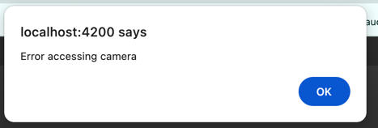

# Bandwidth Check

A simple web application to measure and analyze bandwidth usage.

## Setup Instructions

1. **Clone the repository**
```sh
git clone https://github.com/yaahor/bandwidth-check.git
```
   
2. Install dependencies
```sh
npm install
```

3. Start the project
```sh
npm run serve
```

4. Open in browser
Visit: http://localhost:4200

## Persistence & Video Storage Approach
Video Storage: The application uses IDBDatabase (IndexedDB) for storing video data locally. This allows efficient storage and retrieval of large files without excessive memory usage.
Persistence: Since IndexedDB is an asynchronous, key-value store within the browser, it ensures data remains available even after page reloads.

## Assumptions & Challenges
Assumptions:

This implementation is meant to fulfill the minimal requirements of the test task.

It prioritizes functionality over code structure, maintainability, or best practices.

## Challenges:

No dedicated design for smaller devices, which may affect usability on mobile screens.

## Notes
This project is a basic implementation with minimal focus on structure, long-term maintainability, code style, or testing.

## Screenshots

Checking the bandwidth


Recording


Deleting


Playing


Accessing


Quality picking


Bandwidth check error


Camera access error

